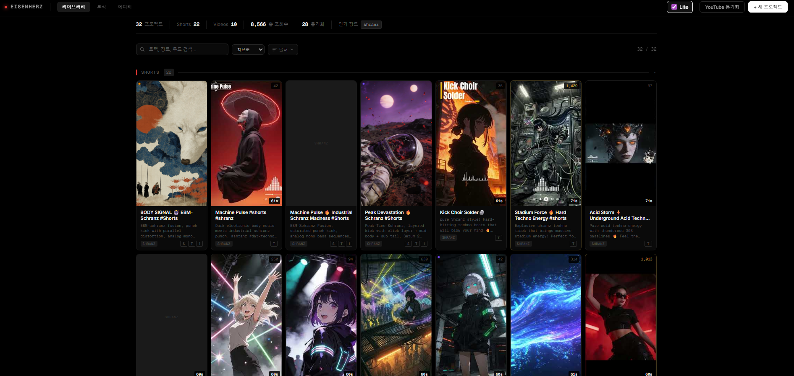
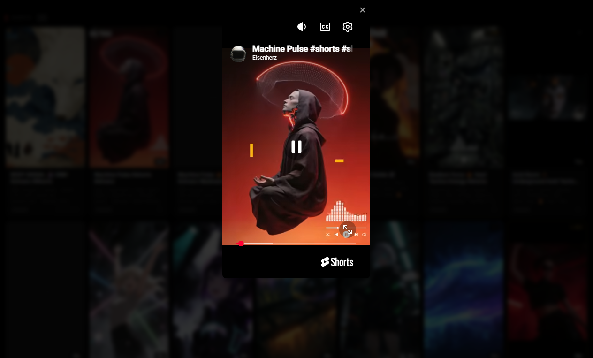
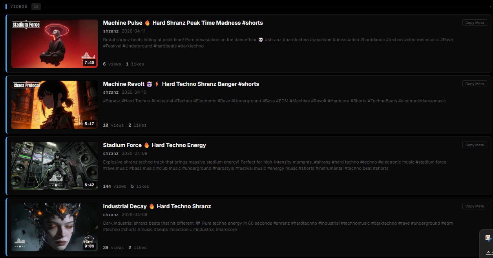
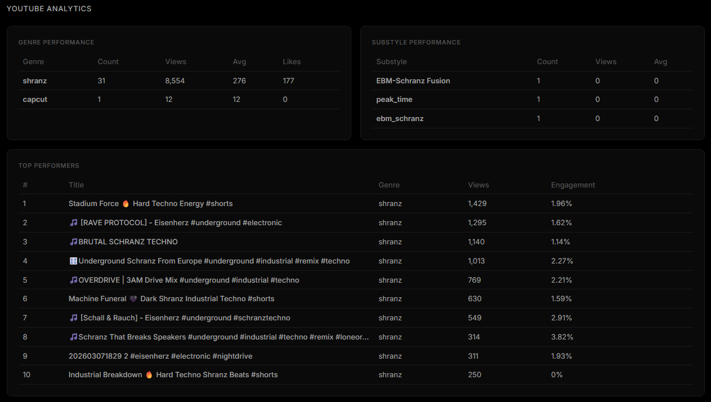
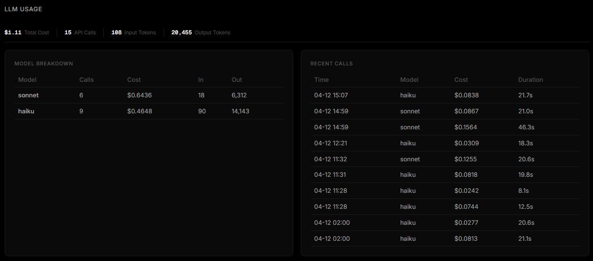

# TuneBoard

Content library + AI prompt workstation for YouTube Shorts music channels.
**$0 API cost** — runs on Claude CLI (Max subscription), no per-token charges.

YouTube Shorts 음악 채널을 위한 콘텐츠 라이브러리 + AI 프롬프트 워크스테이션.
**API 비용 $0** — Claude CLI(Max 구독) 기반으로 토큰 과금 없이 사용 가능합니다.











---

## Why

Running a YouTube Shorts music channel, you run into these problems:

- You **forget the prompts** that made your best-performing videos — what you typed into Suno, what style you used for the video
- You **judge performance by gut feeling** instead of data — which genre or substyle actually gets views?
- You **rewrite prompts from scratch** every time you make a new video
- You **can't see your entire channel** at a glance

TuneBoard solves this:

1. **Prompt Archive** — Saves Suno music prompts + video prompts per project. Pull up the exact recipe of any high-performing content anytime.
2. **YouTube Channel Sync** — Pulls all videos via Data API v3, tracks views/likes/comments. Auto-classifies Shorts vs Videos.
3. **Performance Analytics** — Compare average views and engagement rate by genre and substyle. See what actually works, not what you think works.
4. **AI Prompt Generation** — Enter a genre, get Suno prompt + 4-set video prompts instantly. For shranz, auto-rotates through 12 substyles to avoid repetition.
5. **Zero API Cost** — Uses Claude CLI with Max subscription. Every LLM call (Suno prompt, video prompt, metadata) costs $0.

---

## 왜 만들었나

YouTube Shorts 음악 채널을 운영하면 이런 문제가 생깁니다:

- 조회수 잘 나온 영상의 **프롬프트를 까먹는다** — Suno에 뭘 넣었는지, 어떤 스타일로 영상을 만들었는지
- 어떤 장르/서브스타일이 **성과가 좋은지 감으로만 판단**한다
- 새 영상 만들 때마다 프롬프트를 **처음부터 다시 쓴다**
- 채널 전체 콘텐츠를 **한눈에 못 본다**

TuneBoard는 이 문제를 해결합니다:

1. **프롬프트 아카이브** — Suno 음악 프롬프트 + 영상 프롬프트를 프로젝트 단위로 저장. 조회수 잘 나온 콘텐츠의 레시피를 언제든 다시 꺼내볼 수 있습니다.
2. **YouTube 채널 싱크** — Data API v3로 채널 전체 영상을 가져와서 조회수/좋아요/댓글 추적. Shorts와 Videos를 자동 분류합니다.
3. **성과 분석** — 장르별, 서브스타일별 평균 조회수와 engagement rate를 비교. "이번 달은 어떤 스타일이 먹혔나"를 데이터로 봅니다.
4. **AI 프롬프트 생성** — 장르만 넣으면 Suno 프롬프트 + 4세트 영상 프롬프트가 동시에 나옵니다. shranz 계열은 12개 서브스타일 중 최근 안 쓴 걸 자동 선택합니다.
5. **API 비용 $0** — Claude CLI(Max 구독) 기반. Suno 프롬프트, 영상 프롬프트, 메타데이터 생성 모두 추가 과금 없음.

---

## Core Flow

```
Genre select → Suno prompt + Video prompt auto-generation
장르 선택    → Suno 프롬프트 + 영상 프롬프트 자동 생성
                    ↓
          Create music in Suno, video in Kling/Higgsfield
          Suno에서 음악 생성, Kling/Higgsfield에서 영상 생성
                    ↓
          Upload to YouTube → Channel sync auto-registers to library
          YouTube 업로드   → 채널 싱크로 자동 라이브러리 등록
                    ↓
          Analyze views/engagement → Apply insights to next content
          조회수/engagement 분석  → 다음 콘텐츠에 반영
```

## Features

- **Content Library** — Shorts(9:16) grid + Videos(16:9) list, mood tags, motif tags, notes
- **Suno Prompt Generator** — Genre-aware music prompts + structured lyrics ([Verse], [Chorus], etc.)
- **Suno Workflow Panel** — Step-by-step one-click copy (Style → Description → Exclude) + "Open Suno" button
- **Prompt Variations** — Regenerate Suno prompts with history tracking. Switch between variants anytime.
- **Video Prompt Generator** — 4-set prompts (Zoom/Pan/Subject/Atmosphere) for Higgsfield/Kling
- **Project Clone** — Duplicate a high-performing project's settings and regenerate prompts
- **YouTube Sync** — Auto-pull channel metadata + stats via Data API v3
- **YouTube First Comment** — Auto-post pinned first comment via YouTube Comments API
- **Comment Sentiment Analysis** — Fetch comments + LLM analysis (sentiment, themes, notable quotes)
- **Analytics** — Genre/substyle performance ranking, LLM cost tracking
- **Substyle Coverage** — Visual grid of all 12 substyles showing usage count. Batch-create projects for unused substyles.
- **Smart Substyle Selection** — Performance-weighted auto-pick based on YouTube view stats. Unused substyles get exploration bonus.
- **Beat Marker Export** — Download beat timestamps as SRT (for CapCut timeline markers) or JSON
- **Preview** — Play YouTube videos directly from cards
- **Model Toggle** — Switch between Haiku (fast) and Sonnet per project
- **Genre Defaults** — Auto-toggle instrumental mode per genre (shranz = instrumental, k-pop = vocals)

---

## Suno Workflow

프로젝트 생성 시 Suno 프롬프트가 자동 생성되고, **Suno Workflow 패널**에서 Suno 웹사이트에 넣을 값을 순서대로 복사할 수 있습니다.

1. **1. Style** 클릭 → 클립보드에 복사
2. **2. Description** 클릭 → 클립보드에 복사
3. **3. Exclude** 클릭 → 클립보드에 복사
4. **Open Suno** 클릭 → suno.com/create 새 탭

### Prompt Variations (변주)

마음에 안 드는 프롬프트? **변주 생성** 버튼으로 새로운 변주를 만들 수 있습니다. 이전 프롬프트는 히스토리에 자동 저장되고, 언제든 **복원** 가능합니다.

### Project Clone (복제)

조회수 잘 나온 프로젝트의 설정(장르, substyle, mood 태그)을 그대로 가져와서 프롬프트만 새로 생성합니다. 프로젝트 상세 → **복제** 버튼.

---

## Smart Substyle Selection

12개 shranz substyle 중 다음 곡에 쓸 스타일을 자동 선택합니다.

- **YouTube 조회수 가중치**: 조회수 높은 substyle에 더 높은 확률
- **탐색 보너스**: 아직 안 써본 substyle에 1.5배 가중치로 다양성 확보
- YouTube Sync 후 stats가 쌓일수록 추천이 정교해집니다

### Substyle Coverage & Batch

Analytics 탭에서 12개 substyle 중 어떤 걸 썼고 안 썼는지 한눈에 볼 수 있습니다.
**미사용 N개 배치 생성** 버튼으로 빈 substyle에 프로젝트를 일괄 생성합니다.

---

## YouTube Integration

### First Comment (고정 댓글)

메타데이터 생성 시 `first_comment`가 자동으로 만들어집니다.
YouTube에 영상이 업로드된 상태라면 **게시** 버튼 한 번으로 댓글이 자동 포스팅됩니다.

> OAuth `credentials.json` 필요. `youtube.force-ssl` scope 포함.

### Comment Sentiment Analysis (댓글 감정 분석)

YouTube에 올린 영상의 댓글을 가져와서 LLM(Haiku)으로 분석합니다.

- **sentiment**: positive / mixed / negative
- **top_themes**: 청중이 반응하는 주제 3개
- **notable_quotes**: 인상적인 댓글
- **summary**: 1-2문장 요약

프로젝트 상세 메타데이터 스텝 → **댓글 분석** 버튼.

---

## Beat Marker Export (CapCut 연동)

음악을 업로드하면 BPM + 비트 타임스탬프가 자동 분석됩니다.
CapCut에서 편집할 때 비트 위치를 참고할 수 있도록 두 가지 형식으로 내보냅니다:

### SRT (CapCut용)

```
1
00:00:00,400 --> 00:00:00,500
●  Beat 1

2
00:00:00,800 --> 00:00:00,900
●  Beat 2
```

CapCut에서 **자막 import** → SRT 파일 선택 → 타임라인에 비트 마커 표시.
씬 경계에는 `▶ CUT 1`, `▶ CUT 2` 마커도 포함됩니다.

### JSON (자동화용)

```json
{
  "bpm": 155,
  "beats": [{"beat": 1, "time_sec": 0.4}, ...],
  "scenes": [{"scene": 1, "start_sec": 0, "end_sec": 8.2}, ...]
}
```

Prompts 스텝에서 **Beat Markers (SRT)** / **Beat Data (JSON)** 다운로드.

---

## Quick Start

```bash
git clone https://github.com/slimex200-wq/youtube-shorts-music.git
cd youtube-shorts-music
pip install -r requirements.txt
cp .env.example .env   # Set YOUTUBE_API_KEY, YOUTUBE_CHANNEL_HANDLE
python -m uvicorn web:app --host 127.0.0.1 --port 8000
```

Open `http://localhost:8000`

## Requirements

- Python 3.11+
- Claude CLI (free on Max) or Anthropic API key

### LLM Backends

| Backend | Config | Cost |
|---------|--------|------|
| Claude CLI (default) | Claude Max subscription | **$0 per call** |
| Anthropic API | `LLM_MODE=api` + `ANTHROPIC_API_KEY` | Pay per token |

## Customization

Genre presets are currently tuned for **shranz/hard techno**. To adapt for your genre:

| What | File | What to change |
|------|------|---------------|
| Genre production knowledge | `config/genres.json` | Add your genre's BPM, instruments, texture (no code changes) |
| Substyle definitions | `config/substyles.json` | Replace with your own substyle variants (no code changes) |
| Channel knowledge base | `config/visual_system.md` | Rewrite with your channel's visual identity |
| Default genre fallback | `config/genres.json` | Change `"default_genre"` to your primary genre |

장르 프리셋은 현재 **shranz/hard techno**에 맞춰져 있습니다. 자신의 장르에 맞게 수정하려면:

| 항목 | 파일 | 변경 내용 |
|------|------|----------|
| 장르 프로덕션 지식 | `config/genres.json` | BPM, 악기, 텍스처 설명 추가 (코드 수정 불필요) |
| 서브스타일 정의 | `config/substyles.json` | 자신만의 서브스타일로 교체 (코드 수정 불필요) |
| 채널 비주얼 KB | `config/visual_system.md` | 채널 비주얼 아이덴티티로 재작성 |
| 기본 장르 | `config/genres.json` | `"default_genre"`를 주력 장르로 변경 |

## Architecture

```
web.py                    FastAPI server
models/project.py         JSON-based project storage
services/
  suno_prompt.py          Suno music prompt generation (with performance-weighted substyle selection)
  higgsfield_prompt.py    Video prompt generation (4 motion types)
  metadata.py             YouTube SEO metadata
  youtube_sync.py         YouTube Data API sync
  comment_analyzer.py     YouTube comment sentiment analysis (LLM-powered)
  uploader.py             YouTube upload + auto first-comment posting
  llm.py                  LLM abstraction (CLI + API)
  kb.py                   Visual system knowledge base
  shranz_substyles.py     12 substyle definitions + smart selection
  beat_analyzer.py        BPM + beat detection
static/
  index.html              Single-page dashboard
  app.js                  Frontend logic
  styles.css              Industrial control panel UI
```

## Security

TuneBoard includes the following security measures:

- **Path traversal protection** — All uploaded filenames are sanitized; directory traversal (`../`) is rejected on every upload and download endpoint.
- **XSS mitigation** — User-facing strings (error messages, YouTube video IDs) are escaped before DOM insertion. YouTube video IDs are validated against a strict 11-character regex.
- **API key masking** — The settings API returns only the last 2 characters of stored API keys.

> **Note:** TuneBoard is designed as a **single-user local tool**. It does not include authentication or rate limiting.

## License

MIT
